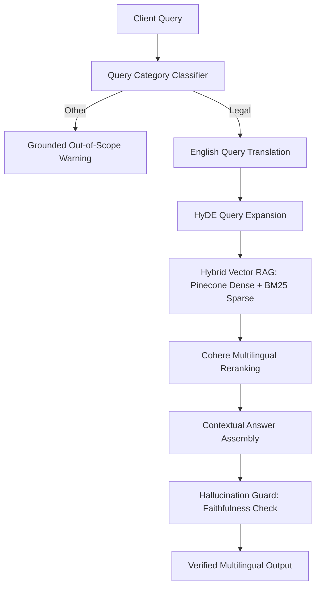

# Adhikar साथी 🏛️

> **AI-Powered Legal Advisory & Verified Advocate Discovery Platform for India**
>
> Grounded in Indian Law • Multilingual (10+ Languages) • Real-time OCR Notice & Agreement Analyzer • Conversational Telephony Adapters

---

## 🚀 Recent Redesign & Live Integrations

- **Awwwards-Grade Visuals:** Revamped the landing page layout with custom mouse-tracking parallax fields, glowing background vectors, asymmetric grid lines, and smooth rotating SVG seals built around clean, transparent gold and emerald judicial assets.
- **Fully Live Lawyer Dashboard:** Removed historical mock fallbacks. The advocate dashboard (Client Requests, Reviews, Consultations, and Live Analytics) is now fully integrated with Supabase PostgreSQL endpoints.
- **Race Condition Loading Shields:** Implemented client-side loading spinners and deferred component mounting to handle asynchronous Supabase session initialization on page refresh, eliminating any flash of mock fallback profiles.

---

## 📖 Table of Contents
1. [What Is Adhikar साथी?](#-what-is-adhikar-साथी)
2. [System Architecture & Directory Map](#-system-architecture--directory-map)
3. [User Experience & Portals](#-user-experience--portals)
4. [AI, RAG & Vision Pipelines](#-ai-rag--vision-pipelines)
5. [Database Schema & Security](#-database-schema--security)
6. [Tech Stack](#-tech-stack)
7. [Running Locally](#%EF%B8%8F-running-locally)
8. [Environment Configurations](#%EF%B8%8F-environment-configurations)
9. [Verification Workflow](#-verification-workflow)

---

## 🏛️ What Is Adhikar साथी?

Adhikar साथी is a modern digital platform designed to bridge the gap between complex Indian legislation and the everyday citizen. By combining state-of-the-art Generative AI with a verified directory of local legal practitioners, it offers immediate, grounded guidance in the user's native tongue.

| Feature | Capabilities & Implementations |
| :--- | :--- |
| **Instant Advisory** | Dual-mode reasoning: **Fast Mode** (streaming conversational answers) or **Verified Mode** (hybrid vector RAG + Cohere reranking). |
| **Multilingual Support** | Query and receive structured replies in **10 Indian languages** (Hindi, Tamil, Telugu, Bengali, Marathi, Gujarati, Kannada, Malayalam, Punjabi, Odia, and English). |
| **Legal Doc Scanner** | OCR notice analyzer checking **12 document types** (FIRs, Summons, Rental Deeds, etc.) extracting risk metrics (0-1.0), summaries, key clauses, and critical dates. |
| **Advocate Discovery** | GPS-aware search matching clients to vetted local lawyers based on specialisation, fee parameters, and spoken languages. |
| **Interactive Voice Portal** | Telephony webhook integrations (Vapi.ai) with audio translation, persona mapping, and Redis caching. |

---

## 📁 System Architecture & Directory Map

```
adhikarsathi/
├── backend/                  ← FastAPI application
│   ├── app/
│   │   ├── api/v1/           ← Controllers (auth, lawyer, admin, voice, doc, query)
│   │   ├── middleware/       ← Rate limiters (Redis), Auth verification
│   │   ├── models/           ← Pydantic schemas and database models
│   │   ├── services/         ← Core business logic
│   │   │   ├── case_predictor/     ← Predicts case weights & complexity metrics
│   │   │   └── hallucination_guard/ ← Sentence-level RAG faithfulness verification
│   │   └── utils/            ← Redis adapters, LLM wrappers, speech preprocessors
│   └── tests/                ← Pytest test suites (auth, lawyer, query routes)
├── frontend/                 ← React SPA (TypeScript + Zustand + Tailwind + Vite)
│   ├── src/
│   │   ├── api/              ← Live Axios/Fetch clients for API routes
│   │   ├── components/       ← UI layouts (home hero, dashboard panels)
│   │   ├── context/          ← Session managers (AuthContext)
│   │   ├── pages/            ← Top-level route pages (Client, Lawyer, Admin dashboards)
│   │   └── types/            ← Type declarations for lawyer stats, calendar items
├── supabase/                 ← Database migrations, Row Level Security rules, and seeds
└── agents/                   ← Telephony adapters (Vapi webhook) and messaging gateways
```

---

## 👥 User Experience & Portals

### 1. Client Portal
- **Immersive Query Area:** Input natural queries in local languages, selecting either Fast or Verified responses.
- **RAG Citations Panel:** Displays verified document highlights, specific statutory articles, and confidence scores.
- **Notice & Contract Analyzer:** Dropzone uploads that immediately extract clause commitments, timeline dates, and legal cross-references.
- **Advocate Search:** Refine search fields to find local practitioners, review profiles, check fees, and book video consults.

### 2. Lawyer Dashboard
- **Live Statistics Overview:** Real-time profile views, active rating counters, response rate calculations, and visibility toggles.
- **Lead Inbox:** Intake board detailing client query summaries, location details, and active countdown indicators for incoming requests.
- **Consultation Calendar:** Integrated monthly view for scheduling and joining secure, in-platform video advisory links.
- **Review Feed:** Interactive list of ratings with options for advocates to publish direct, public replies.

### 3. Verification Desk (Admin Only)
- **Document Audit Interface:** Access to private Supabase storage links to review submitted certificates and identity papers.
- **Action Dashboard:** Fast action triggers to **Verify** or **Reject** applications with descriptive audit trails.

---

## 🤖 AI, RAG & Vision Pipelines



### RAG Integration Details (`backend/app/services/verified_mode.py`)
- **Hybrid Retrieval:** Dense retrieval runs via `SentenceTransformer('mixedbread-ai/mxbai-embed-large-v1')` against Pinecone; sparse token retrieval uses a pre-calculated BM25 encoder file.
- **Reranker:** Cohere's `rerank-multilingual-v3.0` evaluates retrieval candidates, discarding low-relevance metadata indices.
- **Hallucination Guard:** Runs a self-check evaluation loop on candidate answers, validating factual fidelity against source text blocks, assigning a confidence rating, and returning structured citations.

### Document Analysis Pipeline (`backend/app/services/doc_service.py`)
- **OCR Vision Parser:** Scans and extracts layouts using `pdfplumber` for digital PDFs, and triggers OpenAI Vision API models (`gpt-4o-mini`) for scanned images or photos.
- **Parallel Analyzers:** Initiates concurrent asynchronous tasks evaluating document classes, extracting key clauses with plain explanations, isolating critical dates with relative time remaining, and linking files to standard Indian legal acts.
- **Aggregated Risk Gauge:** Combines severity flags into a single threat metric (low, medium, high, critical), warning users of lock-in constraints, asymmetric terminations, or criminal liabilities.

---

## 🔒 Database Schema & Security

Adhikar साथी stores information on a Supabase PostgreSQL instance secured by **Row-Level Security (RLS)**:
- **`profiles`:** Client details, readable and writable only by the authenticated owner.
- **`lawyer_profiles`:** Detailed credentials for registered advocates. Publicly searchable only if `is_verified` is true; write access is restricted to the owning advocate or administrators.
- **`client_requests`:** Connects clients and lawyers. Row read and write policies ensure that only the requesting client and the matched advocate can view transaction communications.
- **`reviews`:** Grounded reviewer inputs, publicly visible to foster trust but editable only by verified clients.
- **`consultations`:** Private records for booked video consults.

---

## 🛠️ Tech Stack

- **Backend:** FastAPI (Python 3.11), Pydantic v2, structlog
- **Database:** Supabase PostgreSQL 16 + pgvector
- **Retrieval Engine:** Pinecone, Cohere Rerank API, SentenceTransformers
- **In-Memory Cache:** Redis 7 (rate-limiting and TTS audio buffer storage)
- **Frontend Framework:** React 18 (TypeScript), Zustand, Tailwind CSS, Vite
- **Telephony API:** Vapi.ai Webhooks

---

## ⚡ Running Locally

### 1. Spin Up Core Infrastructure
Docker Compose provisions localized PostgreSQL (with pgvector) and Redis instances:
```bash
docker compose up -d
docker compose ps
```

### 2. Backend Setup
```bash
cd backend
python -m venv .venv
.venv\Scripts\activate          # Windows
# source .venv/bin/activate    # Mac/Linux

pip install -e ".[dev]"
cp .env.example .env
# Edit .env with your LLM, Supabase, Cohere, and Pinecone API keys.

# Run migrations to provision tables and RLS rules
supabase db push

# Start development API server
uvicorn app.main:app --reload --port 8000
```
Interactive Swagger Documentation: `http://localhost:8000/docs`

### 3. Frontend Setup
```bash
cd frontend
npm install
cp .env.example .env.local
# Edit .env.local with VITE_SUPABASE_URL, VITE_SUPABASE_ANON_KEY, and VITE_API_URL.

# Auto-generate local TS definitions from your Supabase instance
npx supabase gen types typescript --project-id YOUR_PROJECT_ID > src/lib/database.types.ts

npm run dev
```
Client Interface: `http://localhost:5173`

### 4. Running Test Suites
```bash
cd backend
pytest -v
# Run specific test modules
pytest tests/test_lawyer.py -v
```

---

## ⚙️ Environment Configurations

### Backend Settings (`backend/.env`)
```env
SUPABASE_URL=https://xxxxxxxxxxxx.supabase.co
SUPABASE_ANON_KEY=eyJ...
SUPABASE_SERVICE_ROLE_KEY=eyJ...      # Kept secure, never exposed on client
SUPABASE_JWT_SECRET=                  # Settings -> API -> JWT Secret
REDIS_URL=redis://localhost:6379/0
MAX_FREE_QUERIES_PER_DAY=5
FAST_MODE_ENABLED=true
VERIFIED_MODE_ENABLED=true
DOC_SCANNER_ENABLED=true
SLACK_WEBHOOK_URL=                    # Admin notification hooks
OPENAI_API_KEY=                       # Vision, Fast Mode & Guard LLM endpoints
COHERE_API_KEY=                       # Cohere reranker
PINECONE_API_KEY=                     # Pinecone index integration
PINECONE_INDEX_NAME=                  # Vector database target index
```

### Frontend Settings (`frontend/.env.local`)
```env
VITE_SUPABASE_URL=https://xxxxxxxxxxxx.supabase.co
VITE_SUPABASE_ANON_KEY=eyJ...
VITE_API_URL=http://localhost:8000
```

---

## 🛡️ Verification Workflow

```
Lawyer registers via multi-step frontend form
                     ↓
Auth record created & document placeholders stored in Supabase
                     ↓
Lawyer uploads verification proofs:
  • Bar Council Enrollment Certificate (PDF)
  • Certificate of Practice (AIBE)
  • Government Photo Identity Card
                     ↓
Files saved in private, RLS-secured Supabase storage buckets
                     ↓
Slack webhook notifies Admin team of pending applicant
                     ↓
Admin inspects PDFs, verifies, and triggers Approval or Rejection
                     ↓
Lawyer profile updated, triggers email notification, and goes live in LawyerFinder
```

---
*Adhikar साथी — Empowering every Indian with accessible, verified legal guidance.*
